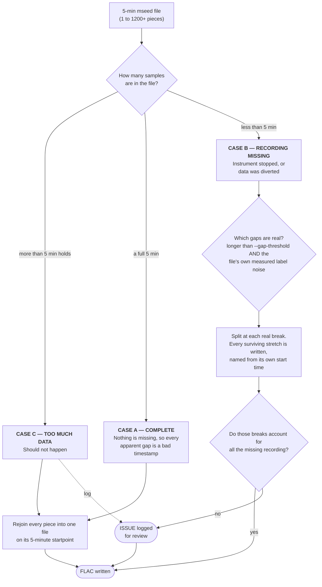

# ooi-hyd-tools 

Assorted tools for processing Ocean Observatories Initiative hydrophone data. 
For other OOI hydrophone tools see:

https://github.com/Ocean-Data-Lab/ooipy

https://github.com/bnestor/hydrophone_downloader

The repo adapts tools from: 

https://github.com/mbari-org/pbp

https://github.com/ioos/soundcoop

https://github.com/lifewatch/pypam

# How to convert ooi mseed archives to flac or wav
`git clone https://github.com/ooi-data/ooi-hyd-tools.git`

`conda create -n ooi-hyd-tools python=3.11 pip`

`conda activate ooi-hyd-tools`

`cd ooi-hyd-tools`

`pip install -e .`

Now you can run the `acoustic-pipeline` command to convert a single day or multiple days of archived ooi mseed to a day of 5 minute audio files.

```
acoustic-pipeline \
--hyd-refdes "CE04OSBP-LJ01C-11-HYDBBA105" \
--start-date "2025/02/20" \
--end-date "2025/03/15" \
--flag audio
```
Run with `--flag all` to generate hybrid millidecade spectrograms.
`acoustic-pipeline --help` To learn more about each argument. 

Data for the audio stage of the pipeline is output to `./data` dir. Millidecade spectrogram plots are output to `./output` dir.

### Jitter and gap repair

The DDS mislabels when each burst of samples arrived - by anywhere from a fraction of a
millisecond to a quarter second, and the pattern differs between instruments and between
years. It never moves or duplicates recording; only the labels are wrong. So the **number
of samples**, not the timestamps, decides whether any recording is actually missing.
Timestamps are only consulted afterwards, to find where a real break happened.



The repair discards nothing: a file that is short still yields audio, and any missing time
is reported rather than silently dropped. A gap counts as a real break only if it is
longer than `--gap-threshold` (OEK `TrHld2`, default 0.023 s) **and** longer than the
file's own measured label noise - an overlap cannot be real, since one ADC cannot record
an instant twice, so the largest overlap in a file measures how far that file's timestamps
lie (observed 10-250 ms depending on instrument and era). Each file therefore sets its own
threshold, with no per-instrument or per-era tuning.

### File naming and start times

Placement comes from the CI filename, not the traces: a first-trace starttime within the
file's own label noise snaps to the filename, and only a label demonstrably further off wins
- which is how a stretch following a real break gets named, and how the degenerate-timestamp
case below scatters output. Interior trace timestamps only ever locate breaks; they are
never read as absolute time.


What each case looks like on the clock. Every `|` is a boundary where the timestamps claim
one piece ends and the next begins - those boundaries are wrong, and the recording across
them is continuous.

```
                    0:00                                              5:00
                    |                                                    |

CASE A  COMPLETE    [==|==|==|==|==|==|==|==|==|==|==|==|==|=============]   pieces arrive mislabelled
                    [====================================================]   -> 1 file, the whole 5 min
                    19,200,000 samples = a full 5 min, so nothing is missing

CASE B  MISSING     [====|====|====|=====]          [====|====|====|=====]   a real break
                                          ^^^^^^^^^^  3 s of recording genuinely gone
                    [====================]          [====================]   -> 2 files, named from their own start
                    short by exactly 3 s, and that one break accounts for all of it

CASE C  TOO MUCH    [==|==|==|==|==|==|==|==|==|==|==|==|==|=================]
                                                                         ^^^^  more than 5 min holds
                    kept in full, but flagged for review
```


Files are named `{instrument}_{YYYYMMDD}_{HHMMSS}` at whole-second resolution, because that
is the finest mbari-pbp can parse - `meta_gen/utils.py` matches `{prefix}_YYYYMMDD_HHMMSS.`
and nothing after, so any sub-second suffix makes the file invisible to the spectrogram
stage. A recording that resumes mid-second therefore loses up to 1 s in its name; the exact
start is written into the file header instead (`date` and `comment`, readable in both FLAC
and WAV), where nothing truncates it.

### FLAC bit depth

OOI mseed carries 24-bit ADC counts right-justified in int32 (the integer *is* the count,
full scale 2^23); libsndfile's int32 API is left-justified (full scale 2^31). Writing counts
straight to `PCM_24` therefore stored `count >> 8`. Since v1.7 the writer shifts left by 8
first so the true count lands in the 24-bit word.
Full walkthrough, with the numbers and where the +128.9 dB offset came from: [docs/24-bit-counts.md](docs/24-bit-counts.md).

### Audio file metadata

Three fields are set at write time (`_write_audio`), and soundfile maps each onto whichever
tagging scheme the container supports:

| Written as | FLAC (Vorbis comment) | WAV (RIFF `LIST`/`INFO`) | Holds |
| --- | --- | --- | --- |
| `date` | `DATE=` | `ICRD` | exact start, sub-second, ISO 8601 |
| `software` | `SOFTWARE=` | `ISFT` | `ooi-hyd-tools` + package version; libsndfile appends its own |
| `comment` | `COMMENT=` | `ICMT` | `refdes=` `start=` `npts=` `sampling_rate=` `counts=` |

As it appears in a real file:

```
date=2026-08-19T00:00:00.014000Z
software=ooi-hyd-tools 1.7.0 (libsndfile-1.2.0)
comment=refdes=CE04OSBP-LJ01C-11-HYDBBA105 start=2026-08-19T00:00:00.014000Z npts=19200000 sampling_rate=64000 counts=int24_left_justified
```

Reading it back:

```bash
python -c "import soundfile as sf; f=sf.SoundFile('x.flac'); print(f.date); print(f.comment)"
metaflac --list --block-type=VORBIS_COMMENT x.flac   # flac only
ffprobe -hide_banner x.wav                           # either container
```

### Per-day manifest

Each day's FLAC directory also gets `{instrument}_{YYYYMMDD}_manifest.json`, uploaded after the
audio so its presence means the day finished:

```json
{
  "refdes": "CE04OSBP-LJ01C-11-HYDBBA105",
  "date": "2026-08-19",
  "written_by": "ooi-hyd-tools 1.7.1",
  "counts": "int24_left_justified",
  "sampling_rate": 64000,
  "gap_threshold_s": 0.023,
  "source_mseed_files": 288,
  "files_written": 286,
  "seconds_written": 85799.844,
  "day_coverage_pct": 99.31,
  "collisions": [{"stamp": "20260819_014500", "kept_s": 299.84,
                  "dropped_s": 0.06, "dropped_start": "2026-08-19T01:45:00.098000Z"}],
  "files": [{"name": "HYDBBA105_20260819_000000.flac",
             "start": "2026-08-19T00:00:00.014000Z", "npts": 19200000}]
}
```

`files` carries the sub-second starts that filenames round away - one read instead of 288 headers.
`day_coverage_pct` separates a short recording day from a failed upload. `collisions` records
pieces dropped because two started in the same second (see Known issues); that audio is unique
and is written nowhere else.

### Candidate: the same repair upstream, on packets

Notes of what it would take to apply this at
ingest.

The mseed is written by the Antelope ORB driver in
[`oceanobservatories/mi-instrument`](https://github.com/oceanobservatories/mi-instrument),
`mi/instrument/antelope/orb/ooicore/` - `packet_log.py` and `driver.py`. What it does today:

- **Bins on the 5-min grid.** `_get_bin` computes `int(packet_time / 300) * 300`, and the
  filename is that bin start - which is why our repair can treat the filename as the anchor.
- **One obspy `Trace` per packet**, each carrying that packet's own timestamp. Packets are
  2560 samples (40 ms), hence the ~1200 traces we stitch back together in a single file.
- **Zero tolerance at the bin edge.** `add_packet` raises `GapException` the moment a
  packet's timestamp falls outside `[mintime, maxtime)`; the driver then closes the current
  file wherever it stands and opens a new one.
- **Nothing counts samples.** No comparison of what arrived against what a 5-min bin holds.

Nothing in our algorithm is specific to mseed. It is one rule - **a sample count is evidence,
a timestamp is a claim** - plus one measurement - **an overlap is proof of a false claim, so
it bounds how far the claims can be trusted**. Both survive the move to packets intact.

| in this repo | at the packet level |
|---|---|
| 5-min mseed file | a window closed on the grid, held briefly for late packets |
| traces within the file | packets accumulated into that window |
| expected = 300 x sr | unchanged - the window defines it |
| largest overlap in the file | rolling estimate over recent packets, continuously updated |
| CI filename as the anchor | a sample counter, re-anchored only at a real break |
| CASE A / B / C at file close | identical, at window close |

The one structural upgrade is the anchor. The ADC does not silently drop or duplicate a
sample, so within a continuous stretch the true time of sample N is `anchor + N/sr`. Upstream
that means per-packet timestamps need not be trusted at all: carry a counter and re-anchor
only when a gap clears both thresholds. We cannot do this downstream, because we see one file
at a time and must re-derive the anchor from its name.

What is genuinely harder upstream is that there is no lookahead. A window must close before
you can know whether a late packet is still coming, so the rule needs a lateness bound and an
out-of-order buffer - neither of which a reader of a finished archive has to care about.

# How to extract audio of a single event

Use the `event-audio` command to pull a time window of broadband audio, run it through the same jitter/gap repair as the pipeline, and write a single continuous WAV to `./output/events` for listening.

For example, to extract the M5.5 Blanco Fracture Zone earthquake recorded 2026/06/29 at Slope Base Seafloor (the event runs 11:35:44–11:42:04 UTC):

```
event-audio \
--refdes "RS01SLBS-LJ01A-09-HYDBBA102" \
--start "2026-06-29T11:35:44" \
--end "2026-06-29T11:42:04" \
--bandpass 2 1000 \
--normalize \
--speed 2 \
--fade 1.0
```

`--speed` rewrites the sample rate `--bandpass LOW HIGH` isolates event of interest, `--normalize` boosts a quiet clip, and `--fade SEC` tapers both ends. `event-audio --help` for all arguments.

# Hydrophone calibrations

Cal files live in `metadata/cals` as netCDF, one per instrument per deployment, named `{refdes}_{deployment}.nc`, holding the manufacturer sheet values in dB re 1 V/uPa. pbp reads the `sensitivity` variable (the 0/90 average for directional cals; `sensitivity_0`/`sensitivity_90` are kept as the archival record).

The volts-to-counts conversion happens in code, not in the cal files: stock mbari-pbp reads the 24-bit FLAC as float normalized to full scale, and `audio_to_spec.py` sets `VOLTAGE_MULTIPLIER = 3` (the ADC's 3 V full scale), so sheet sensitivities apply unmodified. This replaces the retired `rca_correction_cals` copies carrying a +128.9 dB offset, which paired with an int32-reading pbp fork. The two paths are bit-identical apart from 0.031 dB, the rounding in that old constant (exact: 20log10(2^23/3) = 128.931).

### Calibration yamls are the source of truth

 The reviewable source is one YAML spec per instrument in `metadata/cal_specs/`, holding every deployment (replacing `notebooks/03_PARSE_CAL_TO_NC.ipynb`):

```
cal-to-nc template > metadata/cal_specs/{refdes}.yaml   # scaffold, fill in from the PDF
cal-to-nc build metadata/cal_specs/*.yaml --plot        # write the .nc plus a QA plot
cal-to-nc check metadata/cal_specs/*.yaml               # CI: committed .nc still match specs
cal-to-nc from-nc {refdes}                              # backfill a spec from existing .nc
```

Add a deployment by appending a block under `deployments` and re-running `build`, which warns if mean sensitivity jumps more than 6 dB between consecutive deployments. Specs take either a single `sens` or directional `sens0`/`sens90` (averaged into `sensitivity`). Frequencies default to kHz; set `freq_units: Hz` otherwise. Validation rejects length mismatches, non-ascending frequencies, and values outside -220 to -120 dB.

Transcribing the PDF to yaml is the manual step.

### Where the PDFs come from

https://github.com/OOI-CabledArray/calibrationFiles/tree/master/HYDBBA — named `{asset_id}__{YYYYMMDD}.pdf`, matching the `asset_id` and `cal_date` in each spec. OOI asset management also has a `calibration/HYDBBA` directory, but the sensitivity tables exist only in these PDFs.

### How a cal file is selected

`find_cal_file()` in [audio_to_spec.py](ooi_hyd_tools/audio_to_spec.py) reads the deployment table live from OOI asset management:

```
https://raw.githubusercontent.com/oceanobservatories/asset-management/refs/heads/master/deployment/{node}_Deploy.csv
```

`{node}` is the first 8 characters of the refdes. The deployment whose window contains the date picks `cals/{refdes}_{deployment}.nc`; a missing file raises rather than silently producing uncalibrated output. That CSV's `sensor.uid` column also gives which physical asset was deployed, which is how a deployment maps to a cal sheet. `--apply-cals false` skips calibration.

Built files carry `source_spec`, `source_pdf`, `sensitivity_units`, and `placeholder` when the cal is a stand-in — `find_cal_file` logs a run-time warning on placeholders.

### Known issues to fix

Ordered by size of the error on delivered spectrograms.

| issue | where | detail |
|---|---|---|
| Reprocess | `HYDBBA302` 2016-07-12 to 2017-07-31 | deployment 3 had been calibrated with a 2018 sheet postdating a hardware rebuild. Cal is now correct; products from that window are **-4.68 dB off on average, up to 8.65 dB at 190.7 kHz** |
| Reprocess | `HYDBBA102` 2016-07-17 to 2017-07-29 | deployment 3 had been calibrated with deployment 2's hydrophone. Cal is now correct; products from that window carry the old one, **-2.10 dB off on average, up to 5.40 dB at 90.4 kHz** |
| Cal gap | all instruments, 10 Hz - 10 kHz | Sheet tables start at 10 kHz, so specs anchor 0 Hz to the 10 kHz value and flat-extrapolate below. Certificates print a separate low-frequency spot value (-170.1 dB @ 26 Hz vs -171.05 @ 10 kHz on `ATOSU-58324-00015__20231213`), implying **~1 dB error across the band carrying most of the energy**. Biases absolute levels, not trends |
| Untracked | all instruments | Cal sheets bake a **preamp gain** (36 dB on sheets seen) into the quoted sensitivity, but specs have no field for it. A different gain would silently break the counts-per-volt chain |
| Step change | all instruments, >12 kHz | The v1.7 bit-depth fix removed **+0.96 dB at the quiet end of 20-27 kHz** (+0.45 at 12-20 kHz, nothing below 12). Within single-measurement variability - the 20-27 kHz L05 spreads 7.6 dB in one day - but a *step* in a multi-year record. Note the reprocess date per instrument for trend work |
| Placeholder | `HYDBBA105` dep 10 | Most recent available cal; the correct one is not yet published upstream |
| No cal | `HYDBBA303` deps 4-9 (2017-07-31 to 2024-08-11), `HYDBBA103` deps 1-11 | No calibration transcribed, so `--flag viz`/`all` raises `FileNotFoundError` - roughly seven years of HYDBBA303. Assignments exist in `OOI-CabledArray/deployments`, so this is transcription work. **Deprioritised**: both are mooring-mounted |
| Collision loss | all four seafloor instruments 2016-07-20; extent unknown | CI emits the real 5-min file plus a companion 16 µs later, and whole-second filenames cannot separate the pair. The guard keeps the longer piece and logs an ISSUE, but the discarded piece is **unique audio, not a duplicate** - confirmed by sample comparison, and one fragment starts 9,288 samples *before* the file it collides with. Lost on 2016-07-20: **2.08 / 3.02 / 1.50 / 0.50 s** on `102`/`106`/`302`/`105`, ~7 s of 96 h. Fixes are sub-second filenames (needs mbari-pbp) or merge-on-collision (needs overlap handling); both deferred as disproportionate |
| Junk stub files | same instruments and day | A stub straddling the boundary (`01:44:59.998` vs `01:45:00.000`) rounds to its own second, so it never collides and survives as a 64-sample, 380-byte FLAC. `HYDBBA102` delivered 622 mseed for a nominal 288-file day, yielding 294 full FLAC + **152 stubs** + 176 superseded. Acoustically harmless but inflates file counts by a third and pollutes pbp metadata. A minimum-duration floor at write time would drop them; not implemented |
| Duplicated packets | `HYDBBA105` and `HYDBBA302` 2023-06-15 17:25-17:35 UTC, extent unknown | CASE C (more samples than a 5-min window holds) on **two instruments ~450 km apart, same three windows, matching magnitudes**: +3.08 s at 17:25, +0.15 s at 17:30 and 17:35 on both. Simultaneity rules out an ocean or instrument cause and points to shore-side packetization, likely duplicated packets during a restart. Audio is kept whole and flagged per OEK, so those six FLACs run slightly over 300 s: **known-suspect for sample-accurate work**. First ever observation of CASE C; **the archive has never been swept for it** |
| Degenerate timestamps | `HYDBBA102` 2023-06-15, extent unknown | Every trace in a file carries one **identical** timestamp - 383 traces all claiming `00:01:54.083000` - so labels span 0.25 s while the file holds 95.8 s of audio. That value sits 0-300 s after the file's nominal start, so naming from the first trace (OEK §9) scatters output across the day and **fragments the spectrogram**, though the archive's filenames are clean 5-min boundaries. Audio is written correctly; only placement is wrong. Detector: labels cannot span less wall-clock time than the audio they contain (10 of 11 sampled files fail). Fix is to name from the filename and skip gap-splitting when it trips; not implemented, **not surveyed elsewhere**. Root cause is upstream and looks bounded: `packet_log.py` only began setting a per-trace starttime in commits of 2023-09-10 / 2023-10-03 ("Adds starttime fix", "Implements Antelope starttime metadata fix"), so before that every trace inherited one header value. 2023-06-15 falls in that window. **Deployment dates unconfirmed**, so the end of the affected era is a guess until surveyed |

Re-run `cal-to-nc build` after editing a spec. Calibrations exist for HYDBBA105, HYDBBA106, HYDBBA302 and HYDBBA303 since program inception; moorings since 2025.

# OOI reference designators (refdes) for broadband hydrophones and approximate lat/lon:

`"CE02SHBP-LJ01D-11-HYDBBA106": (44.63721, -124.30564), "Oregon Shelf"`

`"CE04OSBP-LJ01C-11-HYDBBA105": (44.36933, -124.95347), "Oregon Offshore"`

`"RS01SBPS-PC01A-08-HYDBBA103": (44.51516, -125.3899), "Slope Base Platform"`

`"RS01SLBS-LJ01A-09-HYDBBA102": (44.51505, -125.39002), "Slope Base Seafloor"`

`"RS03AXBS-LJ03A-09-HYDBBA302": (45.81676, -129.75426), "Axial Base Seafloor"`

`"RS03AXPS-PC03A-08-HYDBBA303": (45.81671, -129.75405), "Axial Base Platform"`


Interactive map of assets at https://app.interactiveoceans.washington.edu/map
