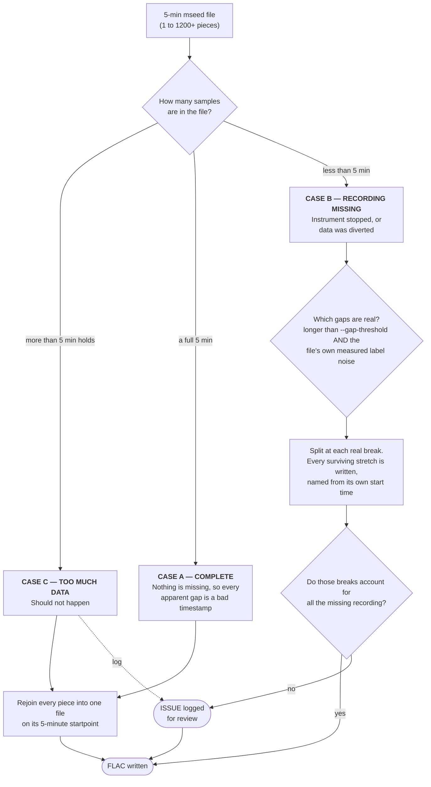

# ooi-hyd-tools 

Assorted tools for processing Ocean Observatories Initiative hydrophone data. 
For other OOI hydrophone tools see:

https://github.com/Ocean-Data-Lab/ooipy

https://github.com/bnestor/hydrophone_downloader

The repo adapts tools from: 

https://github.com/mbari-org/pbp

https://github.com/ioos/soundcoop

https://github.com/lifewatch/pypam

## Contents

| section | what it covers |
| --- | --- |
| [Converting mseed to flac or wav](#how-to-convert-ooi-mseed-archives-to-flac-or-wav) | the CLI, and how the gap repair, naming and bit depth work |
| [Running from a local mirror](#running-from-a-local-mirror) | reading mseed from a mounted copy of the archive instead of the raw data server |
| [Pipeline stages](#pipeline-stages) | what each `--flag` reads and writes |
| [What gets written](#what-gets-written) | per-file header tags, the per-day manifest, and the cal recorded in each spectrogram |
| [Single event audio](#how-to-extract-audio-of-a-single-event) | pulling one event rather than a whole day |
| [Hydrophone calibrations](#hydrophone-calibrations) | cal specs, where the sheets come from, how one is chosen |
| [Known issues to fix](#known-issues-to-fix) | current defects, ordered by size of error on delivered products |
| [Candidate work upstream](#candidate-the-same-repair-upstream-on-packets) | what applying the repair at ingest would take |
| [Reference designators](#ooi-reference-designators-refdes-for-broadband-hydrophones-and-approximate-latlon) | refdes and approximate lat/lon |

Longer notes live in [`docs/`](docs/):

- [**24-bit-counts.md**](docs/24-bit-counts.md) - how a sample travels from pascals to counts
  to volts and back, why 24-bit counts needed a left shift, and where the +128.9 dB
  calibration offset came from.
- [**data-access.md**](docs/data-access.md) - S3 layout, how to read the FLAC, timing caveats
  and the per-day manifest. Written for external users; safe to hand out.

# How to convert ooi mseed archives to flac or wav
`git clone https://github.com/ooi-data/ooi-hyd-tools.git`

`conda create -n ooi-hyd-tools python=3.11 pip`

`conda activate ooi-hyd-tools`

`cd ooi-hyd-tools`

`pip install -e .`

Now you can run the `acoustic-pipeline` command to convert a single day or multiple days of archived ooi mseed to a day of 5 minute audio files.

```
acoustic-pipeline \
--hyd-refdes "CE04OSBP-LJ01C-11-HYDBBA105" \
--start-date "2025/02/20" \
--end-date "2025/03/15" \
--flag audio
```
`--flag all` (the default) also generates hybrid millidecade spectrograms.
`acoustic-pipeline --help` To learn more about each argument. 

Data for the audio stage of the pipeline is output to `./data` dir. Millidecade spectrogram plots are output to `./output` dir.

### Running from a local mirror

On a machine with the raw archive mounted, `--mseed-root` reads the broadband mseed from disk
instead of the OOI raw data server:

```
acoustic-pipeline \
--hyd-refdes "CE02SHBP-LJ01D-11-HYDBBA106" \
--start-date "2024/11/03" \
--mseed-root ~/ooi/san_data \
--runner local
```

The mirror must be laid out as `ROOT/<refdes>/YYYY/MM/DD/`, with an optional `addendum/` in
each day, and keep the archive's filenames (`OO-HYEA2--YDH-<start>.mseed`) - each file's
nominal start is read from its name. Anything else in a day directory, such as the
per-segment `.png`, is ignored. Repaired traces are sample-identical to a remote run of the
same files.

- A day with no mseed is skipped, as on the remote archive. A missing `ROOT/<refdes>` raises
  instead, since an unmounted share would otherwise look like a run of empty days.
- Only the broadband `audio` and `all` stages read the mirror. `--mseed-root` is refused with
  `--runner prefect` (the cloud workers cannot see a local mount) and with `low_freq`, `obs`
  or `spectrogram`, which do not read this archive.

### Pipeline stages

`--flag` picks which stage runs. Broadband spectrograms are built from FLAC on disk, not
from mseed, so the two broadband stages can be run separately:

| `--flag` | reads | writes |
| --- | --- | --- |
| `audio` | mseed archive, or a local mirror with `--mseed-root` | `./data/flac/YYYY_MM_DD/INSTRUMENT/` plus the day's manifest |
| `spectrogram` | FLAC already in `./data` | `./output/INSTRUMENT_YYYYMMDD.{nc,png}` |
| `all` | same as `audio` | both, in one pass |
| `low_freq` | Earthscope, via `ooipy` | `./output/INSTRUMENT_YYYYMMDD.png` |
| `obs` | Earthscope FDSN web service | `./output/SITE/` seismometer plots |

`audio` and `all` always rebuild from the archive; neither skips a day that is already on
disk. To redo only the spectrogram - the usual case when pbp failed but the audio is fine -
run `--flag spectrogram`, which reuses the FLAC and never touches the raw data server. It
raises `FileNotFoundError` if the day's manifest is missing.

`low_freq` and `obs` are separate paths: both pull from Earthscope rather than the raw
archive and never read `./data/flac`, so the FLAC check does not apply to them.

## How the repair works
### Jitter and gap repair

The DDS mislabels when each burst of samples arrived - by anywhere from a fraction of a
millisecond to a quarter second, and the pattern differs between instruments and between
years. It never moves or duplicates recording; only the labels are wrong. So the **number
of samples**, not the timestamps, decides whether any recording is actually missing.
Timestamps are only consulted afterwards, to find where a real break happened.


```mermaid
flowchart TD
    IN["5-min mseed file<br/>(1 to 1200+ pieces)"] --> Q{"How many samples<br/>are in the file?"}

    Q -->|"more than 5 min holds"| C["<b>CASE C — TOO MUCH DATA</b><br/>Should not happen"]
    Q -->|"a full 5 min"| A["<b>CASE A — COMPLETE</b><br/>Nothing is missing, so every<br/>apparent gap is a bad timestamp"]
    Q -->|"less than 5 min"| B["<b>CASE B — RECORDING MISSING</b><br/>Instrument stopped, or<br/>data was diverted"]

    C --> KEEP["Rejoin every piece into one file<br/>on its 5-minute startpoint"]
    A --> KEEP
    C -.->|log| FLAG(["ISSUE logged<br/>for review"])

    B --> WHERE{"Which gaps are real?<br/>longer than --gap-threshold AND the<br/>file's own measured label noise"}
    WHERE --> SPLIT["Split at each real break.<br/>Every surviving stretch is written,<br/>named from its own start time"]
    SPLIT --> CHECK{"Do those breaks account for<br/>all the missing recording?"}
    CHECK -->|yes| OUT(["FLAC written"])
    CHECK -->|"no"| FLAG

    KEEP --> OUT
    FLAG --> OUT
```

The repair discards nothing: a file that is short still yields audio, and any missing time
is reported rather than silently dropped. A gap counts as a real break only if it is
longer than `--gap-threshold` (OEK `TrHld2`, default 0.023 s) **and** longer than the
file's own measured label noise - an overlap cannot be real, since one ADC cannot record
an instant twice, so the largest overlap in a file measures how far that file's timestamps
lie (observed 10-250 ms depending on instrument and era). Each file therefore sets its own
threshold, with no per-instrument or per-era tuning.

### File naming and start times

Placement comes from the CI filename, not the traces: a first-trace starttime within the
file's own label noise snaps to the filename, and only a label demonstrably further off wins
- which is how a stretch following a real break gets named, and how the degenerate-timestamp
case below scatters output. Interior trace timestamps only ever locate breaks; they are
never read as absolute time.


What each case looks like on the clock. Every `|` is a boundary where the timestamps claim
one piece ends and the next begins - those boundaries are wrong, and the recording across
them is continuous.

```
                    0:00                                              5:00
                    |                                                    |

CASE A  COMPLETE    [==|==|==|==|==|==|==|==|==|==|==|==|==|=============]   pieces arrive mislabelled
                    [====================================================]   -> 1 file, the whole 5 min
                    19,200,000 samples = a full 5 min, so nothing is missing

CASE B  MISSING     [====|====|====|=====]          [====|====|====|=====]   a real break
                                          ^^^^^^^^^^  3 s of recording genuinely gone
                    [====================]          [====================]   -> 2 files, named from their own start
                    short by exactly 3 s, and that one break accounts for all of it

CASE C  TOO MUCH    [==|==|==|==|==|==|==|==|==|==|==|==|==|=================]
                                                                         ^^^^  more than 5 min holds
                    kept in full, but flagged for review
```


Files are named `{instrument}_{YYYYMMDD}_{HHMMSS}` at whole-second resolution, because that
is the finest mbari-pbp can parse - `meta_gen/utils.py` matches `{prefix}_YYYYMMDD_HHMMSS.`
and nothing after, so any sub-second suffix makes the file invisible to the spectrogram
stage. A recording that resumes mid-second therefore loses up to 1 s in its name; the exact
start is written into the file header instead (`date` and `comment`, readable in both FLAC
and WAV), where nothing truncates it.

### FLAC bit depth

OOI mseed carries 24-bit ADC counts right-justified in int32 (the integer *is* the count,
full scale 2^23); libsndfile's int32 API is left-justified (full scale 2^31). Writing counts
straight to `PCM_24` therefore stored `count >> 8`. Since v1.7 the writer shifts left by 8
first so the true count lands in the 24-bit word.
Full walkthrough, with the numbers and where the +128.9 dB offset came from: [docs/24-bit-counts.md](docs/24-bit-counts.md).

## What gets written
### Audio file metadata

Three fields are set at write time (`_write_audio`), and soundfile maps each onto whichever
tagging scheme the container supports:

| Written as | FLAC (Vorbis comment) | WAV (RIFF `LIST`/`INFO`) | Holds |
| --- | --- | --- | --- |
| `date` | `DATE=` | `ICRD` | exact start, sub-second, ISO 8601 |
| `software` | `SOFTWARE=` | `ISFT` | `ooi-hyd-tools` + package version; libsndfile appends its own |
| `comment` | `COMMENT=` | `ICMT` | `refdes=` `start=` `npts=` `sampling_rate=` `counts=` |

As it appears in a real file:

```
date=2026-08-19T00:00:00.014000Z
software=ooi-hyd-tools 1.7.0 (libsndfile-1.2.0)
comment=refdes=CE04OSBP-LJ01C-11-HYDBBA105 start=2026-08-19T00:00:00.014000Z npts=19200000 sampling_rate=64000 counts=int24_left_justified
```

Reading it back:

```bash
python -c "import soundfile as sf; f=sf.SoundFile('x.flac'); print(f.date); print(f.comment)"
metaflac --list --block-type=VORBIS_COMMENT x.flac   # flac only
ffprobe -hide_banner x.wav                           # either container
```

### Per-day manifest

Each day's FLAC directory also gets `{instrument}_{YYYYMMDD}_manifest.json`, uploaded after the
audio so its presence means the day finished:

```json
{
  "refdes": "CE04OSBP-LJ01C-11-HYDBBA105",
  "date": "2026-08-19",
  "written_by": "ooi-hyd-tools 1.7.1",
  "counts": "int24_left_justified",
  "sampling_rate": 64000,
  "gap_threshold_s": 0.023,
  "source_mseed_files": 288,
  "files_written": 286,
  "seconds_written": 85799.844,
  "day_coverage_pct": 99.31,
  "collisions": [{"stamp": "20260819_014500", "kept_s": 299.84,
                  "dropped_s": 0.06, "dropped_start": "2026-08-19T01:45:00.098000Z"}],
  "files": [{"name": "HYDBBA105_20260819_000000.flac",
             "start": "2026-08-19T00:00:00.014000Z", "npts": 19200000}]
}
```

`files` carries the sub-second starts that filenames round away - one read instead of 288 headers.
`day_coverage_pct` separates a short recording day from a failed upload. `collisions` records
pieces dropped because two started in the same second (see Known issues); that audio is unique
and is written nowhere else.

### Spectrogram calibration attributes

Each spectrogram `.nc` records the cal it was built with as global attributes, read from the
cal file `find_cal_file` selected, so a later change to the deployment lookup or a cal file
is visible after the fact:

| attribute | holds |
| --- | --- |
| `calibration_file` | the cal file applied, e.g. `CE04OSBP-LJ01C-11-HYDBBA105_12.nc`; `none` with `--apply-cals false` |
| `calibration_deployment` | the deployment that cal belongs to |
| `calibration_asset_id` | the hydrophone asset |
| `calibration_date` | date of the vendor cert |
| `calibration_source_pdf` | the cert PDF the values were transcribed from |
| `calibration_placeholder` | present only for a stand-in cal, with the reason (see Known issues) |
| `calibration_lf_sensitivity` | the cert's 26 Hz spot value, present only once it is transcribed for that deployment |
| `calibration_lf_corner_hz` | the high-pass corner modelled below 26 Hz, present with `calibration_lf_sensitivity` |

`instrument` is also set from the cal file's model (`icListen model SB2-ETH` or `SB35-ETH`).
The models differ by deployment and `globalAttributes.yaml` is shared by every product, so the
static value is just `icListen`; that is what a product built with `--apply-cals false` keeps.
Products made before October 2026 do not carry these attributes, and their `instrument` says
SB35-ETH regardless of deployment.

# How to extract audio of a single event

Use the `event-audio` command to pull a time window of broadband audio, run it through the same jitter/gap repair as the pipeline, and write a single continuous WAV to `./output/events` for listening.

For example, to extract the M5.5 Blanco Fracture Zone earthquake recorded 2026/06/29 at Slope Base Seafloor (the event runs 11:35:44–11:42:04 UTC):

```
event-audio \
--refdes "RS01SLBS-LJ01A-09-HYDBBA102" \
--start "2026-06-29T11:35:44" \
--end "2026-06-29T11:42:04" \
--bandpass 2 1000 \
--normalize \
--speed 2 \
--fade 1.0
```

`--speed` rewrites the sample rate `--bandpass LOW HIGH` isolates event of interest, `--normalize` boosts a quiet clip, and `--fade SEC` tapers both ends. `event-audio --help` for all arguments.

# Hydrophone calibrations

Cal files are netCDF in `metadata/cals`, one per instrument per deployment (`{refdes}_{deployment}.nc`), holding the manufacturer values in dB re 1 V/uPa. pbp reads `sensitivity` - the 0/90 average for directional cals, with `sensitivity_0`/`sensitivity_90` kept as the record. Volts-to-counts happens in code: pbp reads the 24-bit FLAC normalized to full scale and `audio_to_spec.py` sets `VOLTAGE_MULTIPLIER = 3` (the ADC's 3 V full scale), so sheet values apply unmodified. This retired the `rca_correction_cals` copies with a baked-in +128.9 dB offset ([docs/24-bit-counts.md](docs/24-bit-counts.md)).

### Calibration yamls are the source of truth

One YAML spec per instrument in `metadata/cal_specs/` holds every deployment, transcribed by hand from the cert PDF:

```
cal-to-nc template > metadata/cal_specs/{refdes}.yaml   # scaffold, fill in from the PDF
cal-to-nc build metadata/cal_specs/*.yaml --plot        # write the .nc plus a QA plot
cal-to-nc check metadata/cal_specs/*.yaml               # CI: committed .nc still match specs
cal-to-nc from-nc {refdes}                              # backfill a spec from existing .nc
```

- Each deployment block holds a single `sens` curve or directional `sens0`/`sens90`, in kHz (or `freq_units: Hz`), **copied exactly as printed** - no 0 Hz entry.
- `lf_sens` is the cert's "Sensitivity @ 26 Hz", printed beside the table. `build` uses it to model the band below the table: a first-order high-pass at `lf_corner_hz` (default 10 Hz, interim) through the 26 Hz value, blended into the first table point and sampled densely enough for pbp's interpolation to follow. Without it the band is a flat copy of the first table point, and `build` says so.
- Validation rejects length mismatches, non-ascending frequencies and values outside -220 to -120 dB; `build` warns when mean sensitivity jumps more than 6 dB between deployments.
- `notebooks/11_calibration_curve_plot.ipynb` plots every curve as pbp applies it; `plot_cal(refdes, dep, preview_lf_sens=...)` previews a value before it goes in a spec.

### Where the PDFs come from

[calibrationFiles/HYDBBA](https://github.com/OOI-CabledArray/calibrationFiles/tree/master/HYDBBA), named `{asset_id}__{YYYYMMDD}.pdf` to match each spec's `asset_id` and `cal_date`; `OOI-CabledArray/deployments` (`HYDBBA_deployments.csv`) maps each deployment to its cert. Many are scans that GitHub's viewer shows blank - download one before concluding it holds no calibration.

### How a cal file is selected

`find_cal_file()` in [audio_to_spec.py](ooi_hyd_tools/audio_to_spec.py) reads the deployment table live from OOI asset management (`deployment/{node}_Deploy.csv`, `{node}` = first 8 characters of the refdes). pbp applies one sensitivity per day, so the day takes the cal of the deployment covering most of it, with a warning on turnover days. A day with no deployment, or a missing cal file, raises rather than producing uncalibrated output; `--apply-cals false` skips calibration. Built cal files record `source_spec`, `source_pdf`, the `lf_*` values, and `placeholder` for stand-ins, which `find_cal_file` also logs at run time.

# Known issues to fix

Ordered by size of the error on delivered spectrograms.

| issue | where | detail |
|---|---|---|
| Reprocess | `HYDBBA302` 2016-07-12 to 2017-07-31 | Dep 3 was calibrated with a 2018 sheet postdating a hardware rebuild. Cal now correct; products from that window are **-4.68 dB off on average, up to 8.65 dB at 190.7 kHz** |
| Suspect cert | `HYDBBA106` deps 1 and 3 (2014-2015, 2016-2017) | The 2013 cert `ATOSU-58324-00014__20130802` tabulates -175.1 dB at 13.5 kHz, **3-5 dB below every later cert for that hydrophone**, though its 26 Hz value matches them. Transcribed correctly, so either the cert is wrong or the unit changed. Products above 13.5 kHz are suspect by several dB |
| Reprocess | `HYDBBA102` 2016-07-17 to 2017-07-29 | Dep 3 was calibrated with dep 2's hydrophone. Cal now correct; products from that window are **-2.10 dB off on average, up to 5.40 dB at 90.4 kHz** |
| Cal gap | all instruments, below 10 kHz | Cert tables start at 10 kHz (13.5 kHz on four early deployments); below that, cals use the cert's 26 Hz value with a first-order roll-off. The **10 Hz corner is interim** - HydroCal puts icListen HF corners at ~7-15 Hz, so up to ~1.5 dB at 10 Hz - until our units are HydroCal-calibrated. Products **step at deployment boundaries** and on the date the model went in; `calibration_lf_*` attributes mark products that include it |
| Untracked | all instruments | Sheets bake a **preamp gain** into the sensitivity (36 dB on most, 30 dB on `ATAPL-58324-00005__20131211`) but specs don't record it, so a mismatched preamp would go unnoticed |
| Step change | all instruments, >12 kHz | The v1.7 bit-depth fix removed **+0.96 dB at 20-27 kHz** (+0.45 at 12-20 kHz). Within daily variability, but a step in multi-year records; note reprocess dates for trend work |
| Placeholder | `HYDBBA105` deps 2, 4 and 10 | **True vendor cals missing.** Dep 10's doc is a pressure-test certificate, so it uses the prior cal; deps 2 and 4 have only plot-only certs before them, so they use the next later cal. Each carries a `placeholder` reason |
| No cal | `HYDBBA303` deps 1-9 (2014-2024), `HYDBBA103` deps 1-11 (2014-2025) | Not transcribed, so spectrograms raise `FileNotFoundError` for about ten years of each. Certs exist in calibrationFiles. **Deprioritised**: both are mooring-mounted |
| Collision loss | seafloor instruments, 2016-07-20; extent unknown | CI emits a companion file 16 µs after the real one, which whole-second filenames can't separate; the guard keeps the longer piece and logs an ISSUE. The dropped piece is **unique audio**, 0.5-3 s per instrument that day. Fixes (sub-second names, merge-on-collision) deferred |
| Junk stub files | same instruments and day | Stubs straddling a file boundary round to their own second and survive as 64-sample FLACs - **152** of them on `HYDBBA102`'s 622-file day. Acoustically harmless but inflate file counts by a third; a minimum-duration floor would drop them |
| Duplicated packets | `HYDBBA105`, `HYDBBA302` 2023-06-15 17:25-17:35; extent unknown | CASE C (more samples than 5 min holds) on both instruments in the same three windows with matching sizes, pointing to duplicated packets shore-side. Audio is kept and flagged, so six FLACs run slightly over 300 s: **suspect for sample-accurate work**. The archive has **never been swept** for it |
| Degenerate timestamps | `HYDBBA102` 2023-06-15; extent unknown | Every trace in a file shares one timestamp, so naming from the first trace **scatters output and fragments the spectrogram**; the audio itself is correct. Upstream only began per-trace starttimes in Sep-Oct 2023, so earlier data may be affected. Fix (name from the filename when labels span less time than the audio) not implemented; **not surveyed** |

Re-run `cal-to-nc build` after editing a spec. The seafloor instruments (HYDBBA102, 105, 106, 302) have cals from deployment 1; of the mooring-mounted ones, HYDBBA303 from deployment 10 and HYDBBA103 from deployment 12.

# Candidate: the same repair upstream, on packets

Notes of what it would take to apply this at
ingest.

The mseed is written by the Antelope ORB driver in
[`oceanobservatories/mi-instrument`](https://github.com/oceanobservatories/mi-instrument),
`mi/instrument/antelope/orb/ooicore/` - `packet_log.py` and `driver.py`. What it does today:

- **Bins on the 5-min grid.** `_get_bin` computes `int(packet_time / 300) * 300`, and the
  filename is that bin start - which is why our repair can treat the filename as the anchor.
- **One obspy `Trace` per packet**, each carrying that packet's own timestamp. Packets are
  2560 samples (40 ms), hence the ~1200 traces we stitch back together in a single file.
- **Zero tolerance at the bin edge.** `add_packet` raises `GapException` the moment a
  packet's timestamp falls outside `[mintime, maxtime)`; the driver then closes the current
  file wherever it stands and opens a new one.
- **Nothing counts samples.** No comparison of what arrived against what a 5-min bin holds.

Nothing in our algorithm is specific to mseed. It is one rule - **a sample count is evidence,
a timestamp is a claim** - plus one measurement - **an overlap is proof of a false claim, so
it bounds how far the claims can be trusted**. Both survive the move to packets intact.

| in this repo | at the packet level |
|---|---|
| 5-min mseed file | a window closed on the grid, held briefly for late packets |
| traces within the file | packets accumulated into that window |
| expected = 300 x sr | unchanged - the window defines it |
| largest overlap in the file | rolling estimate over recent packets, continuously updated |
| CI filename as the anchor | a sample counter, re-anchored only at a real break |
| CASE A / B / C at file close | identical, at window close |

The one structural upgrade is the anchor. The ADC does not silently drop or duplicate a
sample, so within a continuous stretch the true time of sample N is `anchor + N/sr`. Upstream
that means per-packet timestamps need not be trusted at all: carry a counter and re-anchor
only when a gap clears both thresholds. We cannot do this downstream, because we see one file
at a time and must re-derive the anchor from its name.

What is genuinely harder upstream is that there is no lookahead. A window must close before
you can know whether a late packet is still coming, so the rule needs a lateness bound and an
out-of-order buffer - neither of which a reader of a finished archive has to care about.

# OOI reference designators (refdes) for broadband hydrophones and approximate lat/lon:

`"CE02SHBP-LJ01D-11-HYDBBA106": (44.63721, -124.30564), "Oregon Shelf"`

`"CE04OSBP-LJ01C-11-HYDBBA105": (44.36933, -124.95347), "Oregon Offshore"`

`"RS01SBPS-PC01A-08-HYDBBA103": (44.51516, -125.3899), "Slope Base Platform"`

`"RS01SLBS-LJ01A-09-HYDBBA102": (44.51505, -125.39002), "Slope Base Seafloor"`

`"RS03AXBS-LJ03A-09-HYDBBA302": (45.81676, -129.75426), "Axial Base Seafloor"`

`"RS03AXPS-PC03A-08-HYDBBA303": (45.81671, -129.75405), "Axial Base Platform"`


Interactive map of assets at https://app.interactiveoceans.washington.edu/map
